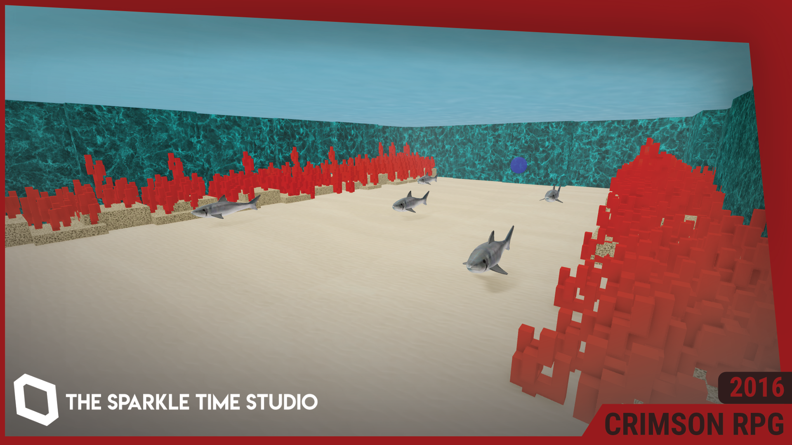

# CRIMSON RPG
CRIMSON RPG is my RPG project made in 2016, which is heavily inspired by darkness999999's Legend of Excalibur RPG, now open-source for the Roblox OSS & Classic RPG community.

This repository contains every version of the game from 2016-08-14 (version 1) to 2021-03-07 (version 527). Each file is named with its placeId, versionId, dateSaved, and whether or not the place version was published to Roblox.

# Usage
Feel free to download, use, modify, distribute and publish this project to your hearts content, under the MIT License. All I ask is that you repost the original license in this document if you plan to fork this software, or give me credit (@Evercyan on Roblox) if you plan to republish it on the Roblox website.
